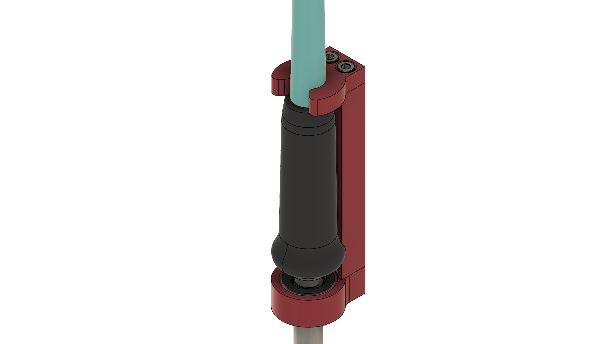
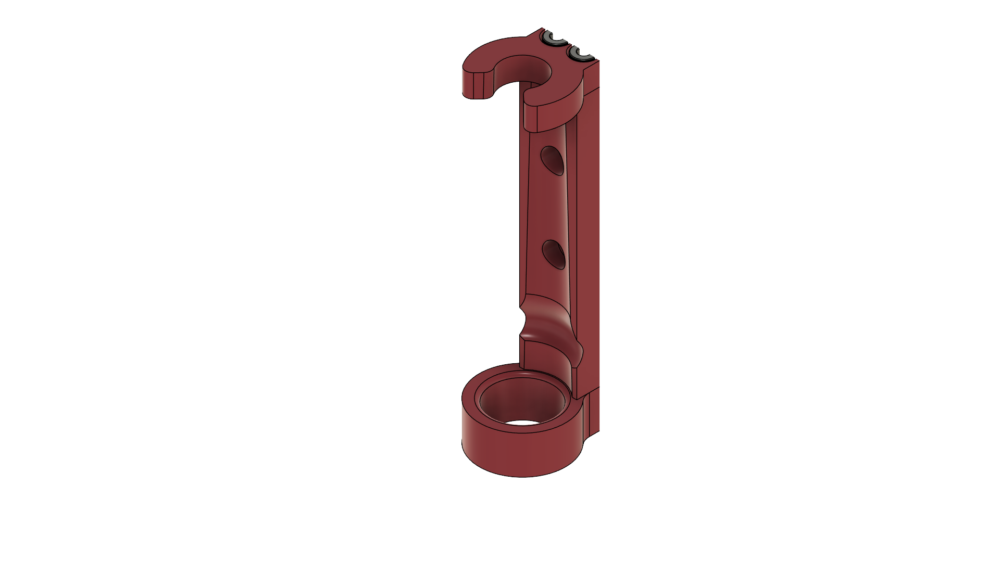
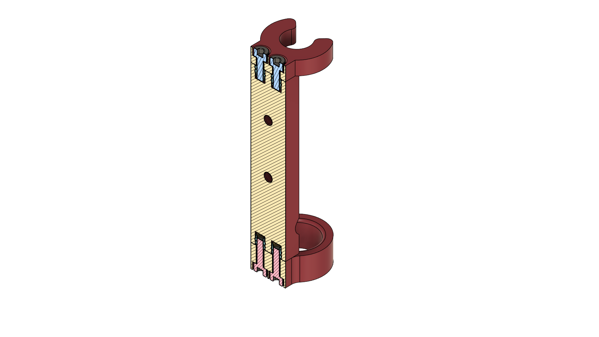

# Rigid mount for the Weller 1010
## BOM
- 2x M3 10mm Hex socket head screws
- 2x M3 8mm Hex socket head screws
- 4x Heat Inserts. Standard Voron size M3x4x5 [AliExpress](https://www.aliexpress.us/item/3256804429544538.html)
## Part pictures
Asembly:

Front view:

Back and section:
